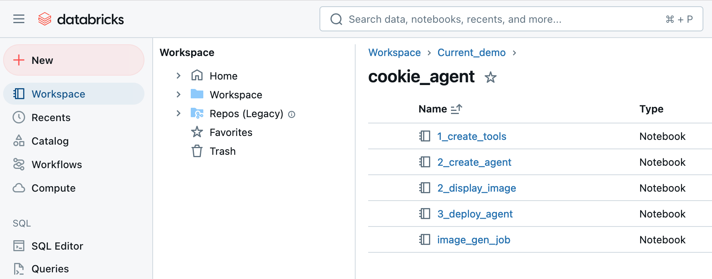
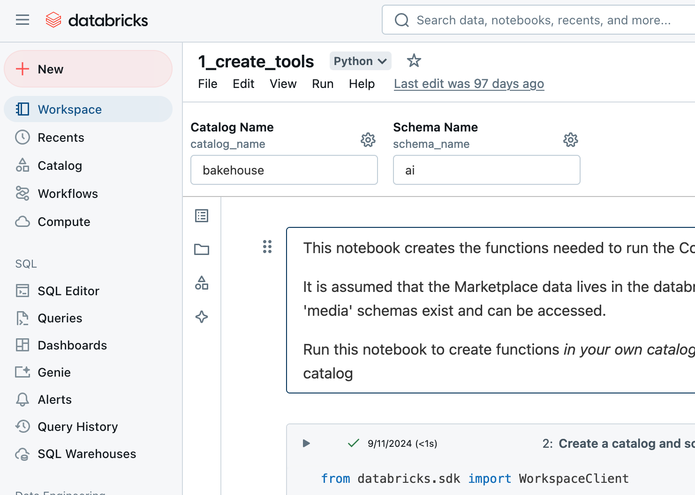

# python code and containers for the Databricks AWS GenAI demo 

## Build 

```
docker buildx build --platform linux/amd64 . -f ./Dockerfile_1 -t dbx_genai_demo_<APP_NO>:<VERSION>-amd64 -t 635910096382.dkr.ecr.us-east-1.amazonaws.com/dbx_genai_demo_<APP_NO>:<VERSION>-amd64

docker push 635910096382.dkr.ecr.us-east-1.amazonaws.com/dbx_genai_demo_<APP_NO>:<VERSION>-amd64

cd kubernetes
./install.sh ./config.properties <DEPLOY_FILE>.yaml

```

## Databricks Starter Script

The `./cookie_agent` folder contains the code used on a Databricks notebook to register an agent and provision AI models.

To create the scripts inside the Databricks workspace, create a folder inside the workspace and create new files.



Paste the contents of the scripts from the `./cookie_agent` folder, and they'll be rendered with the different sections (documentation, python code, SQL statements).

